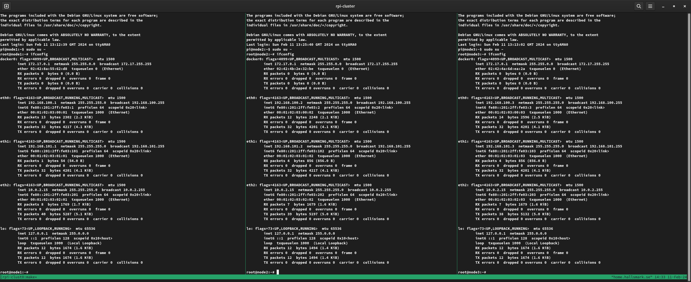
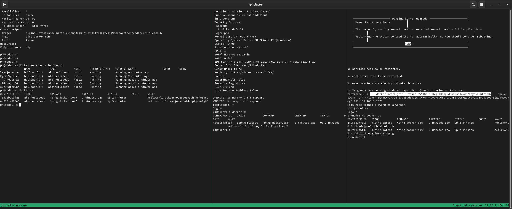

# ARM cluster

Repo with lab bench setup of a cluster of virtual ARM nodes.
This could in a real live world scenario be a bunch of raspberry pi boards

We can bring it all up automatically via a simple

```
make cluster-up
```

And then we get a detached tmux session and inside it a terminal for each cluster node we might
have been created previously.

Again, simple command to start working with it :)

```
make cluster-view
```



And we can then start laborate with some clustered docker swarm workloads :)



## Bring cluster up
```
make cluster-up
```

## Bring cluster down (gracefully)
```
make cluster-down
```

## Add node to cluster
We can create a node X by using "make cluster-nodeX", like this for a first node :
```
make cluster-node1
```
and we can continue add more nodes as needed :
```
make cluster-node2
make cluster-node3
...
```

## accessing nodes
This lab setup simply use pwd "tjosan" for the nodes and we can login like
```
sshpass -p tjosan ssh pi@192.168.101.1 uptime
```
(realworld setup would preferably use ssh keys of course)

## node configuration
TODO

## examples
1. swarmregistry
   Run a container repository/registry in the cluster. This is needed for all other swarm examples too so start with this one...
2. swarmtest
   Simple web app for testing out docker swarm cluster.
